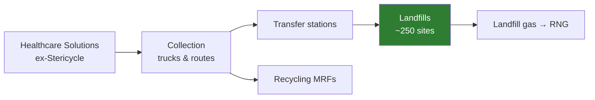

# Waste Management (WM): Investment Take, September 2026

> Not financial advice. Prices and consensus figures are as of 25 Sep 2026; check them again before you act.

## TL;DR

| | |
|---|---|
| **Price** | ~$208 |
| **My DCF (bear / base / bull)** | $135 / **$212** / $313 |
| **Verdict** | **Fairly valued. Hold, or accumulate slowly below ~$190.** |
| **Expected 5-yr CAGR (total return)** | Bear ~2% · **Base ~8–9%** · Bull ~13–14% |
| **Probability-weighted CAGR** | **~8%** |
| **Dividend** | $3.78/yr (~1.8% yield), 23 straight years of increases, ~40% of FCF |

It's a strong, low-risk business, but at this price it looks like a bond-like compounder, not a bargain. Expect market-like returns with lower volatility, not outperformance.

---

## 1. Fact-checking the video

| Claim in video | What the data says | Verdict |
|---|---|---|
| Revenue guidance narrowed/lowered | 2026 revenue cut ~0.6% to $26.275–26.475B, mostly on **lower volumes** | ✅ True |
| Margin forecast raised | Adj. operating EBITDA margin raised 20 bps to 31.0–31.2%. EBITDA ($8.15–8.25B) and FCF ($3.75–3.85B) reaffirmed | ✅ True |
| Forward P/E ~23 | ~25.5x on 2026 consensus EPS ($8.16). ~23x only on 2027 estimates | ⚠️ Flattering |
| "Not strongly correlated with the macro" | The guidance cut was **volume-driven** (industrial/roll-off, special waste). Collection is defensive, volumes aren't | ⚠️ Overstated |
| ROIC ~8.6%, ~10% avg | Plausible. Depressed by the Stericycle goodwill (~$7B deal) | ✅ Reasonable |
| 2026 FCF $3.8B | Matches the midpoint of guidance | ✅ True |
| FCF only reaches $4.8B by 2030 | ~6% CAGR. Conservative, since sustainability capex (RNG/recycling) rolls off from 2026 | ⚠️ Probably too low |
| "Safe defensive **dividend** stock" | Safe, yes. But a 1.8% yield makes it a dividend *grower*, not an income stock | ⚠️ Framing |

---

## 2. How WM makes money (and why it's defensive)



**The moat is the landfill.** New landfills are nearly impossible to permit. Whoever owns the disposal sites sets local pricing, which is why WM can push through price increases above inflation year after year.

---

## 3. Bull vs Bear thesis

| 🐂 Bull | 🐻 Bear |
|---|---|
| Pricing power: price rises beat cost inflation every year | Volumes are cyclical. 2026 already saw a guidance cut |
| Margin expansion: 31%+ EBITDA margin, automation/tech lowering labor cost | Valuation: 25x earnings leaves little room for error |
| **FCF inflection**: sustainability capex rolling off from 2026 means more cash for dividends and buybacks | ROIC ~8–9% is only around cost of capital. Acquisitions (Stericycle) haven't earned their keep yet |
| Healthcare Solutions synergies could beat targets | ~$23B debt. Refinancing at higher rates eats into FCF |
| Consolidator in a fragmented industry, with bolt-on M&A runway | Recycled-commodity and RNG prices are volatile |
| Defensive ballast in a late-cycle economy | Rate sensitivity: "bond proxy" stocks de-rate when yields rise |

---

## 4. DCF (my own estimates, not the video's)

**Method:** unlevered DCF. I start from WM's FCF (which is *after* interest), add back after-tax interest (~$0.75B) to get free cash flow to the whole firm (~$4.55B), discount it at WACC, then subtract net debt (~$23.2B) and divide by ~403M shares.

| Assumption | 🐻 Bear | ⚖️ Base | 🐂 Bull |
|---|---|---|---|
| UFCF growth 2027–31 | 3% | 6% | 8.5% |
| WACC | 8.25% | 7.5% | 7.0% |
| Terminal growth | 2.0% | 2.5% | 3.0% |
| Year-5 UFCF | $5.3B | $6.1B | $6.8B |
| **Fair value / share** | **$135** | **$212** | **$313** |
| vs. price $208 | −35% | +2% | +50% |

```
Price vs fair value ($/share)
Bear   $135 |██████████████
Base   $212 |█████████████████████
Price  $208 |████████████████████▌   ◄ you are here
Bull   $313 |███████████████████████████████
```

**Sensitivity (base case, 6% growth):** the answer depends mostly on the discount rate.

| WACC \ Terminal g | 2.0% | 2.5% | 3.0% |
|---|---|---|---|
| 7.0% | $217 | $243 | $275 |
| **7.5%** | $192 | **$212** | $237 |
| 8.0% | $171 | $187 | $208 |

About 80% of the value sits in the terminal value, so small changes in WACC or terminal growth move fair value by ±$25–40. Treat "$212" as a **range of ~$190–240**, not a point.

---

## 5. What CAGR can you expect?

Total return ≈ **EPS growth + dividend yield ± change in P/E**

| Scenario (5 yr) | EPS growth/yr | 2031 EPS | Exit P/E | Price 2031 | Price CAGR | + Div | **Total CAGR** |
|---|---|---|---|---|---|---|---|
| 🐻 Bear | 5% | $10.4 | 20x | ~$208 | 0% | 1.8% | **~2%** |
| ⚖️ Base | 8% | $12.0 | 24x | ~$288 | 6.7% | 1.8% | **~8.5%** |
| 🐂 Bull | 10% | $13.1 | 28x | ~$368 | 12.1% | 1.7% | **~14%** |

Weighted 25 / 50 / 25 gives **~8% a year**. Of that, ~6% comes from growing earnings, ~2% from the dividend, and the multiple adds nothing on average.

---

## 6. My take

- **Business quality: A.** Landfill moat, pricing power, rising margins, FCF about to step up.
- **Valuation: C+.** At ~25x earnings the price already reflects that quality.
- **Action:** fine as a **core defensive holding** at ~$208 if you're OK with ~8% returns. For a better entry, **~$185–190** (≈20% margin of safety to base value; P/E ~22–23x) lifts the expected CAGR to ~10–11%.
- **Watch next:** Q3 volumes (is the slowdown spreading?), Healthcare Solutions synergy progress, 2027 FCF guidance (the capex roll-off), and 10-yr Treasury yields.

### Sources
- [WM Q2 2026 8-K / earnings release (SEC)](https://www.sec.gov/Archives/edgar/data/0000823768/000110465926087575/tm2621414d1_ex99-1.htm)
- [Seeking Alpha: WM 2026 revenue & margin outlook](https://seekingalpha.com/news/4620731-wm-outlines-2026-revenue-of-26_275b-to-26_475b-while-raising-margin-outlook-to-31-percent-to)
- [Recycling Product News: WM cuts revenue outlook](https://www.recyclingproductnews.com/article/44815/wm-posts-higher-q2-cash-flow-cuts-revenue-outlook-for-2026)
- [StockTitan: 10-Q (debt, EPS)](https://www.stocktitan.net/sec-filings/WM/10-q-waste-management-inc-quarterly-earnings-report-423d5cb1c482.html)
- [FinancialContent/Barchart: 2026 EPS consensus](https://markets.financialcontent.com/stocks/article/barchart-2026-4-10-what-to-expect-from-waste-managements-q1-2026-earnings-report)
- [StockAnalysis: WM dividend](https://stockanalysis.com/stocks/wm/dividend/)
