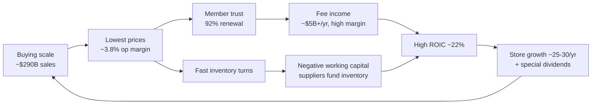
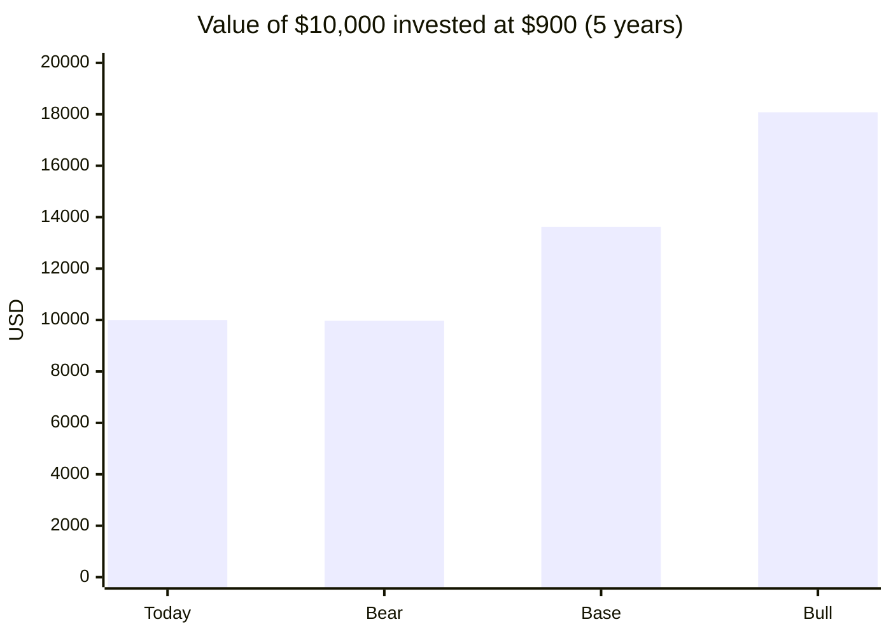
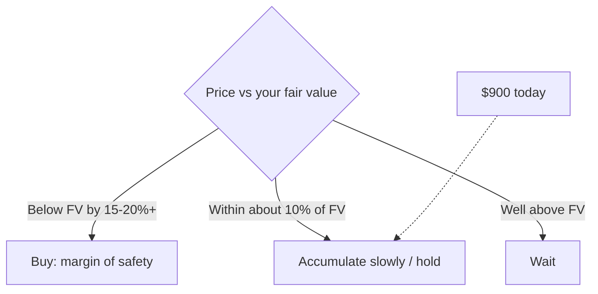

# Costco (COST): Is the ~20% Pullback a Buy? A DCF Check

*As of Sept 25, 2026 · reference price ≈ **$900** · 5-year horizon · educational only, not investment advice*

## TL;DR

| | |
|---|---|
| **Verdict** | **Hold or accumulate slowly. It's not a clear "buy".** It's a great business at a fair-to-full price. |
| **Base 5-yr CAGR** | **~6% a year** (range: ~0% bear to ~13% bull) |
| **Main disagreement with the creator** | Paying 6% *above* your own fair value is a **negative** margin of safety, not one that's "within" it. My base DCF comes out **below** $843. |

---

## 1. Checking the creator's claims

Checked against Costco's Q4 FY26 release (Sept 24, 2026) and public data.

| Claim | Check | Note |
|---|---|---|
| Stock ~20% off highs (~$1,100 → <$900) | ✅ | ~18% off the May high, ~$895–905 before earnings |
| TTM sales ≈ $293B, <1,000 warehouses | ✅ | Q4 sales were $93.9B (+11.2%). About 920 warehouses |
| Digital sales growing fast | ✅ | Q4 digital comps +19.5% |
| Renewal rate >90% (US) | ✅ | US & Canada **92.3%**, worldwide 89.8% |
| Operating margin ≈ 3.8% | ✅ | Thin on purpose |
| Membership fees are the "bulk" of profit | ⚠️ Overstated | About $5.4B/yr in fees vs ~$11B operating income, so **roughly half**, not most |
| Negative working capital (sells goods before paying suppliers) | ✅ | This is the real ROIC engine |
| ROIC ≈ 22.6%, best among peers | ✅ Plausible | Consistent with prior years |
| Forward P/E ≈ 36× | ⚠️ Looks low | $900 ÷ ~$22.7 FY27E EPS ≈ **~40×** |
| DCF $843 vs $897 = "6% over, within margin of safety" | ❌ Logic error | Arithmetic is right (+6.4%). But a margin of safety means buying **below** fair value |
| Bias check | ⚠️ | The video is sponsored by Motley Fool |

**What the Q4 print added:** EPS came in at $6.75 vs $6.55 expected. But **$0.15 of that was a one-off tariff refund**, so the clean beat is about $0.05. FY26 EPS was **$20.76 (≈ $20.61 adjusted)**. Paid members rose 3.8% and executive members 9.4%. One headwind: the **Sept-2024 fee hike is now fully lapped**, so membership-fee growth drops to its organic ~6–7% rate.

---

## 2. How the value is built (the thesis in one picture)

The moat is a **flywheel**: low prices build trust, trust drives renewals, and renewals make fee income predictable. That lets Costco keep prices low. The weak spot isn't the business. **It's the price you pay for it.**

---

## 3. DCF: bear / base / bull

**Setup:** 10-year FCF-per-share DCF. Starting FCF/share is **$19.50**, about 95% of adjusted FY26 EPS. Growth is split into years 1–5 and 6–10, then a terminal (forever) growth rate.

| Scenario | Growth yrs 1–5 | Growth yrs 6–10 | Discount rate | Terminal growth | **Fair value / share** | vs $900 |
|---|---|---|---|---|---|---|
| 🐻 Bear | 7% | 5% | 8.5% | 3.0% | **~$465** | −48% |
| ⚖️ Base | 10% | 7.5% | 8.0% | 3.5% | **~$690** | −23% |
| 🐂 Bull | 12.5% | 9% | 7.5% | 4.0% | **~$1,020** | +13% |

**Reverse DCF (the most useful number):** at an 8% discount rate, **$900 already assumes ~12% FCF growth every year for 10 years.** Costco has grown EPS about 10–12% a year historically. So the current price is fair if the past repeats, but there's **no discount for error**.

**Sensitivity:** fair value by discount rate × 10-yr growth.

| Discount rate ↓ / growth → | 7% | 9% | 11% |
|---|---|---|---|
| 7.5% | $672 | $790 | $929 |
| 8.0% | $594 | $697 | $817 |
| 8.5% | $532 | $623 | $728 |

> 💡 Why the DCF looks "harsh": 60–75% of the value comes from the terminal value. For a stock trading at ~40× earnings, small changes in the discount rate move fair value a lot. That's why the creator's $843 and my $690 can both be "reasonable". Treat any single DCF number as a range, not a point.

---

## 4. Expected 5-year CAGR (what you'd likely earn)

Return = **EPS growth + change in P/E + dividends**. Start: $900, adjusted EPS $20.61. Dividends include regular dividends plus an average of Costco's periodic special dividends.

| Scenario | EPS growth / yr | FY31 EPS | Exit P/E | Price in 2031 | Dividends (5 yrs) | **CAGR** |
|---|---|---|---|---|---|---|
| 🐻 Bear | 7% | ~$28.9 | 30× | ~$867 | ~$30 | **≈ 0%** |
| ⚖️ Base | 10% | ~$33.2 | 36× | ~$1,195 | ~$31 | **≈ 6.4%** |
| 🐂 Bull | 13% | ~$38.0 | 42× | ~$1,595 | ~$32 | **≈ 12.6%** |

**Probability-weighted** (25% bear / 50% base / 25% bull): **≈ 6.3% a year.** That's roughly in line with the broad market's long-run average, but with lower business risk. The key lesson: **even if the business grows ~10% a year, your return is lower because the P/E is likely to shrink from ~40× toward the mid-30s.**

---

## 5. My take vs the creator

- **Agree:** it's one of the best-run retailers alive, and this is the cheapest it has looked in about 2 years.
- **Disagree:** "fairly valued" isn't the same as "cheap". Paying 6% above your own fair value is a negative margin of safety. The math says to expect **mid-single-digit returns**, not the market-beating returns that Costco's past performance might suggest.
- **Practical plan:** if you want to own it, build the position in stages rather than all at once. Start with a small amount now and add more if it falls to **~$750–800** (about 35× adjusted EPS). That's where the base case moves toward ~9–10% a year.

**What would change the view**

| Bull triggers | Bear triggers |
|---|---|
| Faster international store openings (China, Europe) | Comps ex-gas slow toward ~3–4% |
| Executive-member mix keeps rising | Renewal rate slips below 90% (US & Canada) |
| Another fee hike (~2029–30, based on the ~5.5-year cycle) | The market re-rates staples to ~30× |

---

**Sources:** [Costco Q4 FY26 release](https://investor.costco.com/news/news-details/2026/Costco-Wholesale-Corporation-Reports-Fourth-Quarter-and-Fiscal-Year-2026-Operating-Results/default.aspx) · [SEC 8-K](https://www.sec.gov/Archives/edgar/data/0000909832/000090983226000084/costex9918-k92426.htm) · [Traders Agency: tariff-refund benefit](https://tradersagency.com/blog/costco-beats-fiscal-q4-2026-estimates-on-revenue-eps-and-comparable-sales-aided-by-tariff-refunds) · [Yahoo: Q4 call highlights](https://finance.yahoo.com/markets/stocks/articles/costco-wholesale-q4-earnings-call-230217494.html) · [Motley Fool: fee boost running out](https://www.fool.com/investing/2026/09/23/costco-s-membership-fee-boost-is-about-to-run-out/) · [Eastern Herald: Sept 23 price](https://easternherald.com/2026/09/24/costco-nasdaq-cost-stock-september-23-earnings-preview/)
