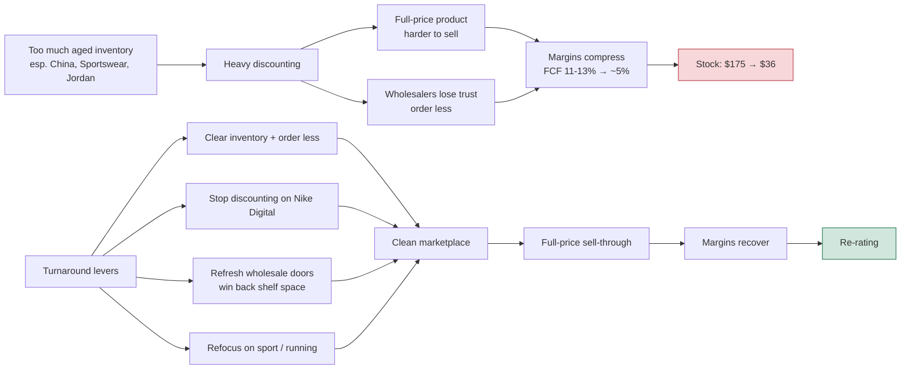
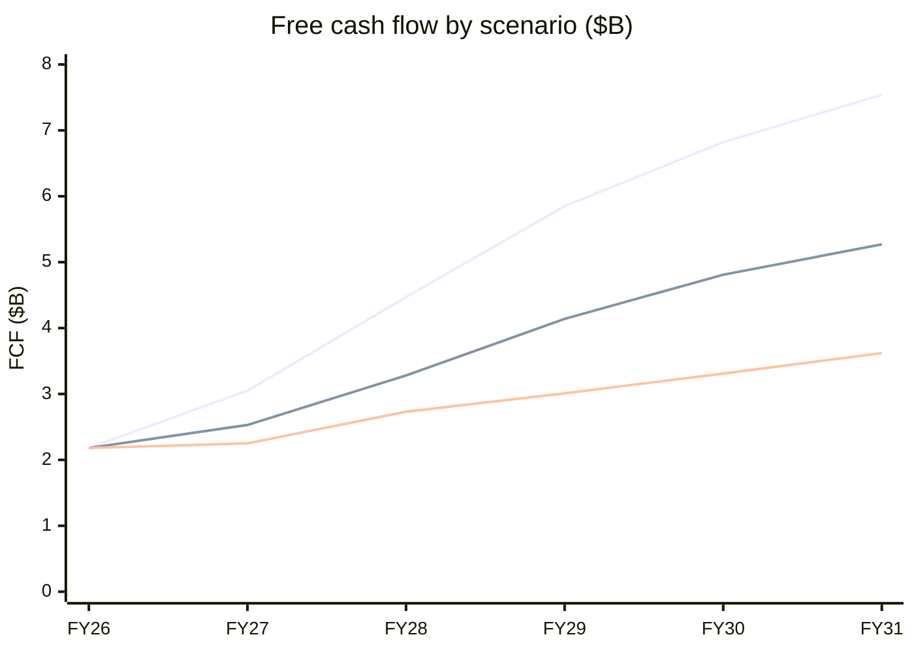
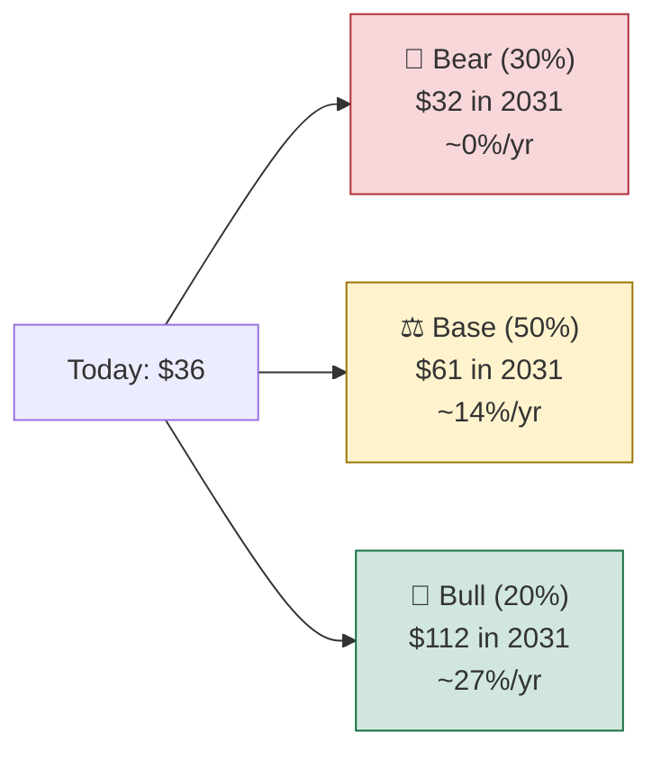

# Nike (NKE): Investment Take, Sep 2026

> **Price used:** ~$36 (52-week low was $35.51 on Sep 18, 2026) · **Horizon:** 5 years · **Next catalyst:** Q1 FY27 earnings on **Oct 1, 2026**
> This is an educational model, not financial advice. The DCF is in [`dcf.py`](./dcf.py). Change the assumptions and run it again.

---

## 1. TL;DR

| | |
|---|---|
| **Verdict** | **Cautious buy, sized small and bought in stages.** The creator's direction is right. His timing ("maybe early") is also right. |
| **Probability-weighted fair value (today)** | **~$49/share**, about 35% above $36 |
| **Expected 5-yr total return CAGR** | **~14%/yr** (bear 0% · base 14% · bull 27%) |
| **What $36 already assumes** | Nike's free cash flow margin stays at **~7% forever**. It was **11–13%** before the turnaround. |
| **Biggest risk the video skips** | The **dividend ($1.64 ≈ $2.4B/yr) is larger than FY26 free cash flow ($2.2B)**. |

---

## 2. Checking the creator's claims

| Claim in the video | Verdict | What the data says |
|---|---|---|
| Trading at a 52-week low, far below the ~$175 high | ✅ True | New 52-week low of $35.51 on Sep 18, 2026. The all-time high was ~$177 (Nov 2021), so the stock is down ~80%. |
| "At our scale, this will take time." The business isn't accelerating yet | ✅ True | FY26 revenue was **$46.4B, flat** (−2% currency-neutral). Guidance for Q4 FY26 through Q2 FY27 is **revenue down low single digits, earnings flattish**. |
| Rebuilding wholesale relationships is working | ✅ Mostly | In Q4 FY26, **wholesale grew +4%** while **Nike Direct fell −7%** (digital −12%). The pivot back to partners shows up in the numbers. *(I couldn't confirm the "15,000 doors" figure from sources I could reach.)* |
| Less discounting on Nike Digital | ✅ Consistent | The digital decline is partly deliberate: Nike is running fewer promotions. It costs revenue now in exchange for better pricing later. |
| Aged inventory, especially in China, is forcing discounts | ✅ True, and **worse than he implies** | Greater China fell **−17% currency-neutral in Q4**, after −10% the quarter before, so the decline is speeding up. Total inventory is flat year over year. Sportswear and Jordan (about half of revenue) are expected to **stay negative in FY27**. |
| Macro pressure on discretionary spending | ✅ True | Consumer discretionary stocks are lagging broadly. Analysts cut targets to $40–48. JPMorgan expects FY27 EPS of $1.55 vs. $1.72 consensus. |
| Upgrading at $40 may have been early | ✅ Likely right | Earnings aren't expected to improve until H2 FY27. |

### ⚠️ What the video leaves out
1. **FY26 earnings look better than they are.** FY26 EPS was **$2.10**, but that includes a **one-time $986M tariff refund**. Without the refund, EPS was about **$1.58 (−27% YoY)**, and Q4 gross margin was 40.2%, not 49.2%.
2. **The dividend isn't fully covered.** At $36 the yield of **4.6%** looks attractive, but paying it takes about $2.4B a year, and FCF was $2.2B. If the turnaround stalls, a dividend cut is a real possibility (my bear case assumes one).
3. **China is getting worse, not better.** Nike is also changing its China online distribution from Jan 2027, which adds short-term disruption.

---

## 3. How the thesis fits together



**In one line:** Nike has to clear the old inventory before its new, full-price products can sell well. The inventory clean-up is the part that *"takes time at our scale."*

---

## 4. The DCF

### A quick refresher (useful for interviews)
A **DCF** values a company as the sum of all its future free cash flows, **discounted** back to today, because a dollar later is worth less than a dollar now.

```
Value of company (EV) = Σ FCFₜ / (1+WACC)ᵗ   +   Terminal Value / (1+WACC)⁵
Terminal Value         = FCF₅ × (1+g) / (WACC − g)
Equity value per share = (EV − net debt) / shares
```
Forecast five years explicitly. Then use the **terminal value** for everything after year 5. That terminal value is usually 60–75% of the total, so the long-run margin assumption matters most.

### Starting inputs (FY26, year ended May 2026)
| Input | Value |
|---|---|
| Revenue | $46.4B |
| Free cash flow | $2.18B (**4.7% margin**, down from $3.27B in FY25) |
| Net debt | ~$2.0B ($9.0B cash vs. $11.0B debt) |
| Diluted shares | ~1.48B |
| Dividend | $1.64/share |

### Scenario assumptions (FY27 → FY31)

| | 🐻 Bear | ⚖️ Base | 🐂 Bull |
|---|---|---|---|
| **Story** | China keeps sliding, discounting drags on, and the dividend is cut | A slow turnaround: marketplace clean by FY28, then steady growth | Innovation plus wholesale wins bring Nike back to peak-era economics |
| Revenue growth | −3%, then +1–2%/yr | −1%, +2%, then +4%/yr | +1%, then +6–7%/yr |
| FY31 revenue | $48.2B | $52.7B | $60.3B |
| FCF margin path | 5.0% → 7.5% | 5.5% → 10.0% | 6.5% → 12.5% |
| FY31 FCF | $3.6B | $5.3B | $7.5B |
| WACC (discount rate) | 9.5% | 9.0% | 8.5% |
| Terminal growth | 2.0% | 3.0% | 3.5% |
| Dividend | cut to $0.80 from FY28 | grows ~2.5%/yr | grows ~5%/yr |
| Buybacks | none | 0.5%/yr | 1.5%/yr |

> The base case assumes FCF margins get back to **10%**. That is still below Nike's FY19–FY24 range of roughly 11–13%. I kept it conservative on purpose.

### Free cash flow path ($B)


<sub>Top line = Bull · middle = Base · bottom = Bear</sub>

### Results

| | 🐻 Bear | ⚖️ Base | 🐂 Bull |
|---|---|---|---|
| **Intrinsic value today** | **$27** | **$49** | **$83** |
| Upside / downside vs. $36 | −24% | +35% | +131% |
| Implied share price in 5 yrs (Sep 2031) | $32 | $61 | $112 |
| Exit multiple implied (Price / FCF) | 13× | 17× | 20× |
| Dividends collected over 5 yrs | $4.84 | $8.60 | $9.06 |
| **Price-only CAGR** | −2.4% | 11.2% | 25.5% |
| **Total-return CAGR (price + dividends)** | **~0%** | **~14%** | **~27%** |
| Probability I assign | 30% | 50% | 20% |

**Probability-weighted:** fair value **≈ $49**, 5-year price **≈ $63**, **expected total-return CAGR ≈ 14%/yr**.



### Reverse DCF: what is $36 pricing in?
Keep the base-case revenue path, a 9% WACC and 3% terminal growth, then solve for the FCF margin that makes the value equal $36. The answer is **~7.1%, held forever.** The market is betting Nike never gets back to even 60% of its old profitability. You don't need the bull case to win. You only need margins to recover to around 9–10%.

---

## 5. Checking the creator's put-selling plan ($30–32 strike)

| Point | Assessment |
|---|---|
| Logic | Sound. You get paid (the premium) to wait for a lower entry price. That suits a situation where the concern is being *early*. |
| $32 compared with my values | $32 sits **between bear ($27) and base ($49)**. It's a good entry, but it doesn't protect you from the bear case. |
| Risk | If you're assigned, the bear case still means ~15% downside from $32. Sell only as many puts as you'd be comfortable holding the shares for. |
| Timing | Implied volatility is usually high before **Oct 1 earnings**, so premiums tend to be richer. |

---

## 6. My take

1. **The creator's thesis checks out.** His facts are right and his caution about timing is justified. He underplays two risks: the one-off tariff refund inflating FY26 EPS, and a dividend that FCF doesn't cover.
2. **The valuation is attractive, but the business hasn't turned yet.** At $36 you're paying for roughly 7% margins forever. If margins recover even modestly, the base case gives **~14%/yr for 5 years**. That's well above the market's long-run ~8–10% average.
3. **How I'd act:** build the position in stages:
   - about 1/3 now (~$36)
   - about 1/3 after Oct 1 earnings, **if** Greater China's decline slows and gross margin improves as guided
   - about 1/3 through cash-secured puts at $30–32
4. **Signs the thesis is working:** gross margin up year over year in Q2 FY27, China's decline under −10%, Sportswear/Jordan sell-through improving, inventory growing more slowly than sales.
5. **Signs to reassess:** China worse than −17%, a dividend cut announced *before* margins recover, or FY27 EPS guidance falling toward $1.40.

---

### Sources
- [Nike FY26 Q4 & full-year results (Nike newsroom)](https://about.nike.com/en/newsroom/releases/nike-inc-reports-fiscal-2026-fourth-quarter-and-full-year-results)
- [Nike swings to Q4 profit on tariff refund boost, but China slump deepens (Yahoo Finance)](https://finance.yahoo.com/markets/stocks/articles/nike-swings-q4-profit-tariff-100705411.html)
- [The $986 Million Reason Nike's Comeback Story Doesn't Add Up (Yahoo Finance)](https://finance.yahoo.com/markets/stocks/articles/986-million-reason-nike-comeback-111806186.html)
- [Nike Stock Hits 52-Week Low (Benzinga)](https://www.benzinga.com/trading-ideas/movers/26/09/61799131/nike-stock-hits-52-week-low-as-consumer-discretionary-lags)
- [JPMorgan cuts Nike 2027 earnings outlook (Benzinga)](https://www.benzinga.com/analyst-stock-ratings/analyst-color/26/08/61528234/jpmorgan-cuts-nike-2027-earnings-outlook-flags-china-rising-competition)
- [At 52 Week Low, What's Going on With Nike Stock? (Motley Fool)](https://www.fool.com/investing/2026/09/19/at-52-week-low-whats-going-on-with-nike-stock/)
- [NKE statistics: cash, debt, shares, dividend (StockAnalysis)](https://stockanalysis.com/stocks/nke/statistics/)
- [NKE free cash flow history (AlphaQuery)](https://www.alphaquery.com/stock/NKE/fundamentals/annual/free-cash-flow)
